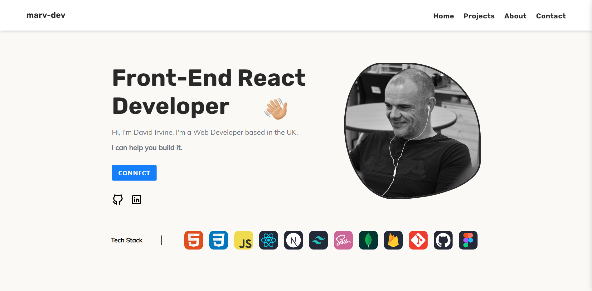
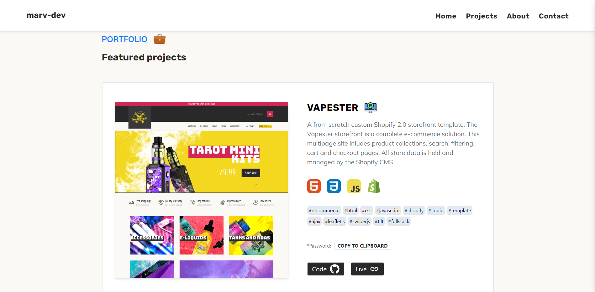
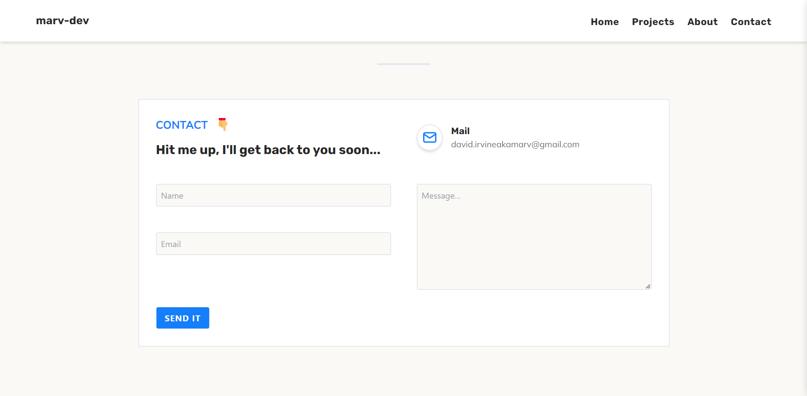
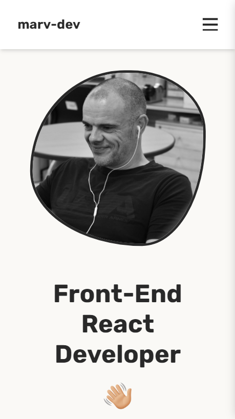
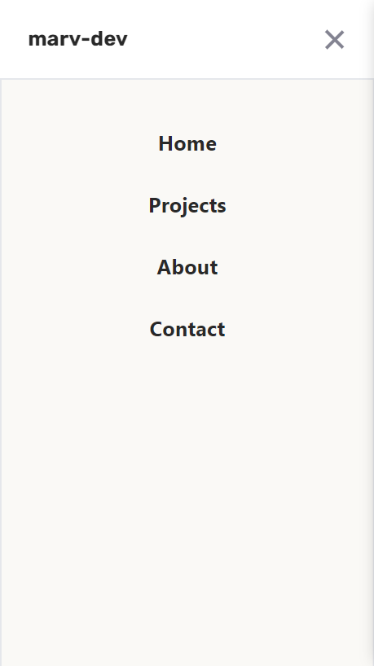

# Portfolio built with React + Vite

I opted for a very simple and clean design, it's not flashy, at all!

The skills icons are from [SkillIconsDev](https://skillicons.dev/).

The contact section is powered by [EmailJS](https://www.emailjs.com/).

## Portfolio Sections 📚

✔️ About me\
✔️ Projects\
✔️ Hero/Home\
✔️ Contact

### Desktop Hero 

### Projects Section 

### Contact Section

### Mobile Hero

### Mobile Menu 
